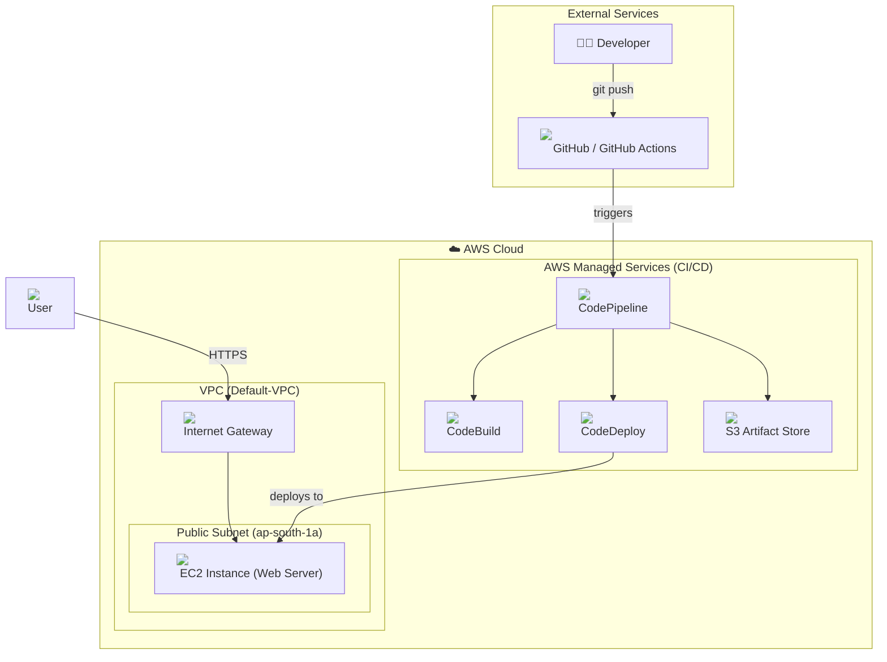

```mermaid
graph TD
    %% Define subgraph for external services
    subgraph "External Services"
        direction LR
        Dev["👨‍💻 Developer"] -- git push --> GitHub["<img src='https://github.githubassets.com/images/modules/logos_page/GitHub-Mark.png' width='30' /> GitHub / GitHub Actions"];
    end

    %% Define subgraph for the AWS Cloud
    subgraph "☁️ AWS Cloud"
        direction LR

        %% Define the VPC and its components
        subgraph "VPC (Default-VPC)"
            direction TB
            IGW["<img src='https://static.thenounproject.com/png/3432025-200.png' width='40' /> Internet Gateway"];

            subgraph "Public Subnet (ap-south-1a)"
                direction TB
                EC2_1["<img src='https://static.thenounproject.com/png/4435315-200.png' width='40' /> EC2 Instance (Web Server)"];
            end

            IGW --> EC2_1;
        end

        %% Define the AWS Managed Services
        subgraph "AWS Managed Services (CI/CD)"
            direction TB
            CodePipeline["<img src='https://symbols.getvecta.com/stencil_95/68_aws-codepipeline.4111322f98.svg' width='40' /> CodePipeline"];
            CodeBuild["<img src='https://symbols.getvecta.com/stencil_95/67_aws-codebuild.b7956b6b3e.svg' width='40' /> CodeBuild"];
            CodeDeploy["<img src='https://symbols.getvecta.com/stencil_95/66_aws-codedeploy.58022d5257.svg' width='40' /> CodeDeploy"];
            S3["<img src='https://symbols.getvecta.com/stencil_95/104_aws-s3.b66014a492.svg' width='40' /> S3 Artifact Store"];
        end
    end

    %% Define connections
    User["<img src='https://static.thenounproject.com/png/1231795-200.png' width='40' /> User"] -- HTTPS --> IGW;
    GitHub -- triggers --> CodePipeline;
    CodePipeline --> S3 & CodeBuild & CodeDeploy;
    CodeDeploy -- deploys to --> EC2_1;

    %% Styling for clarity
    classDef vpc fill:#f9f9f9,stroke:#333,stroke-width:2px;
    classDef subnet fill:#e8f0fe,stroke:#333,stroke-width:1px;
    class Vpc,PublicSubnetAZ1 vpc;
    class PublicSubnetAZ1 subnet;
```
